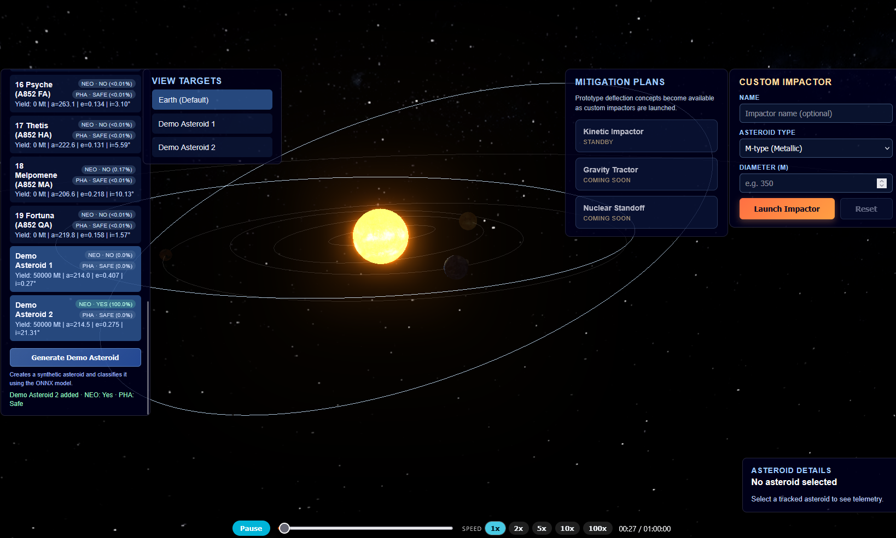

# Astratek Meteor

Monitor asteroids and evaluate its impact. Astratek Meteor is an interactive WebGL experience that blends a physically inspired solar system model with near-Earth object tracking and cinematic post-processing. Built with Three.js and Vite, the project combines real orbital elements, asteroid telemetry, and a custom impact simulation workflow to help users explore how different celestial bodies move and collide.



## Highlights
- **Immersive solar system renderer** – A custom Three.js scene configures orbit controls, bloom, and outline passes to frame planets, moons, and lighting within a responsive renderer.
- **Orbital-mechanics driven animation** – A reusable simulation clock advances per-body spin and orbit channels while keeping time controls in sync with the UI.
- **Asteroid catalogue & telemetry** – Hundreds of asteroid entries are parsed from CSV data, converted into Keplerian elements, and updated in real time, complete with velocity readouts and camera targets.
- **ONNX-powered risk classification** – Each tracked asteroid is automatically standardised and scored as a Near-Earth Object (NEO) and Potentially Hazardous Asteroid (PHA) using the bundled ONNX model, keeping the UI badges in sync with model predictions.
- **Custom impact analysis** – Users can launch bespoke impactors, view yield categories, and inspect the predicted blast zones and effect descriptions through dedicated panels and overlays.
- **UI panels for exploration** – Track asteroids, switch view targets, and inspect impact telemetry with modular UI controllers that wire DOM interactions to simulation state.

## Tech Stack
- [Three.js](https://threejs.org/) for 3D rendering and orbital visualisation
- [postprocessing](https://github.com/pmndrs/postprocessing) effects for bloom and outlines
- [Vite](https://vitejs.dev/) for development tooling and bundling
- [dat.GUI](https://github.com/dataarts/dat.gui) for real-time parameter tweaking

## Getting Started
1. **Install dependencies**
   ```bash
   npm install
   ```
2. **Start the development server**
   ```bash
   npm run dev
   ```
   Vite prints a local development URL (default `http://localhost:5173`) – open it in your browser to explore the simulation.
3. **Build for production**
   ```bash
   npm run build
   ```

> **Note:** The asteroid catalogue is loaded from `static/data/asteroids.csv`. When hosting the production build, ensure the `static` directory is served alongside the compiled assets so the dataset, textures, and ONNX classification assets remain accessible.

## Verifying the ONNX classifier

The `scripts/verify_model.py` helper runs the bundled ONNX model against the CSV catalogue so you can double-check the generated NEO/PHA probabilities outside the browser:

```bash
pip install onnxruntime numpy
python scripts/verify_model.py --limit 5
```

The script standardises each asteroid with the same scaler parameters baked into the web client before running inference. Adjust `--sort` to `pha_probability` or tweak `--threshold` to inspect different slices of the output.

In the browser, ONNX executions are serialised through a lightweight promise queue so the WebAssembly backend never runs overlapping sessions. This avoids the "Session already started" errors that appear when multiple `session.run(...)` calls overlap on slower devices while still allowing the UI to classify every asteroid deterministically.

## Project Documentation
A detailed breakdown of the codebase structure, key modules, and data flow lives in [`docs/PROJECT_STRUCTURE.md`](docs/PROJECT_STRUCTURE.md).

## Assets & Credits
Textures and meshes are adapted from public domain or freely licensed sources, including NASA 3D Resources, Solar System Scope textures, and custom GLTF assets packaged in `src/asteroids/asteroidPack.glb`.

## License
This project is released under the [MIT License](LICENSE).
